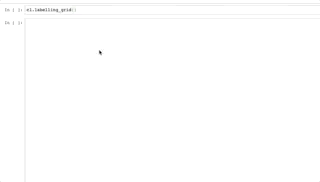

# click2label

To start labelling images with just a mouse click, open `labelling.ipynb` and execute the first two code cells. 

Every time you call the `labelling_grid` method the next set of images will be displayed, and labels of the previous set will be saved. 

Left/right click assigns the first/second label (click again to remove the label).

It loops through everything in the image folder (by default `/data`), and saves labels in `results.csv` (by default within `/labels`)

## Limitations

This was tested using a **Jupyter Notebook enviornment** launched from Anaconda Navigator (using Python 3.7.3). 

If you try to use this in JupyterLabs or VSCode it **will not work** (based on current versions as of time of writing). 

## Extra Labels?

*"My gaming mouse has 7 buttons, why can't I program 7 labels!?"*

You probably can, it would be fairly simple to extend this code to work with more than 2 labels, you just need to find out what `event.button` response corresponds to clicking each button on your mouse. However my lowly mouse has just 2 buttons and 1 scroll wheel. What's worse the `event.button` response for clicking the scroll wheel is the same as for clicking the left button, so as far as Python is concerned my mouse has 2 buttons.

It would be slightly harder, but very possible, to extend the code to work with keyboard events, such that the label changes depending on whether you have a certain key held down or not. 

## License

`click2label` is distributed under the BSD License

## Author

`click2label` was developed by [Gareth Morinan](https://www.linkedin.com/in/gmorinan/)
